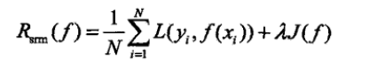
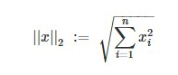
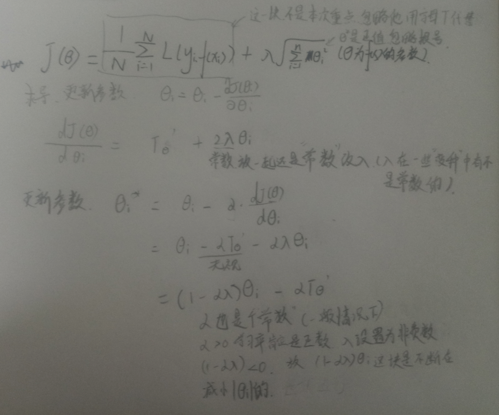
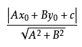
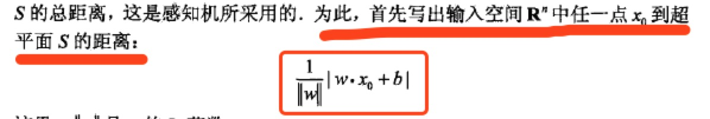
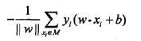

<h1>笔记</h1>
先从L2范数说起，不知道怎么说为什么是用L2范数，但是能解释是用了L2范数能做到什么 
第一章中有提到一条公式，这条公式用来表示模型的loss和复杂度。 
回顾一下第一章的内容 

经验风险最小化: 用来计算模型的损失，一般就是各种loss function了 
结构风险最小化: 用到计算模型的复杂度，我就知道有个L2范数。其他希望有大佬可以补充下 
然后 2个最小化 组合在一起就是那条公式: 
 
左侧经验风险，右侧结构风险。 

接下来说说右侧结构风险 常用的 L2范数是怎么 做结构风险最小的function。 
L2范数: 是这样子的 
 
接着使用这条公式，而衡量模型复杂度的时候一般是用模型的<u>参数的大小来衡量(参数逼近0，也就相当于减少参数了)</u>
故范数公式中的X我们就用模型的参数来作为输入
 
故L2也就做到了减少模型复杂度的作用 
以上观点是我个人看法而已 不一定正确，有大佬明白的话也可以和我说一说。 
<h2>我还想知道模型复杂度这样一直在不断减少，就不能增加吗?</h2>

接着书中感知器L2范数的作用。 
用来计算输入空间到超平面的距离 
点到线的公式
 分母这个也就是L2范数。
故书中公式 

接着乘y来保证距离>0。得到损失函数

<h2>然后L2范数那块可以被省略？why?明明不是常数呀，梯度下降过程会被影响到啊</h2>

接着算法收敛性。 